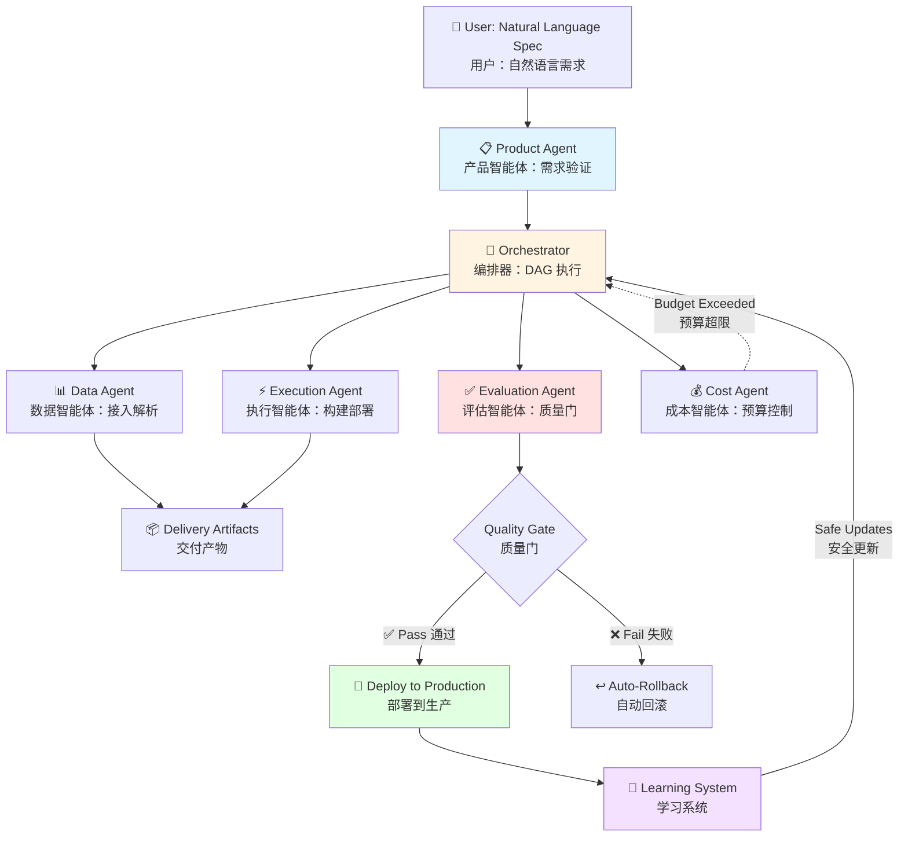

# Agentic Delivery OS

> **Turn "I want to build an AI system" into a production-ready, auditable, rollback-capable deployment — automatically.**
>
> **把"我想做个 AI 系统"自动变成可上线、可审计、可回滚的生产级交付物。**

[](LICENSE)
[](https://www.python.org/downloads/)
[](#)
[](#)

---

## 🎯 What Is This? (一句话说清楚)

**English:**  
A **self-learning, multi-tenant AI delivery platform** that transforms vague requirements into production systems with built-in governance, automatic rollback, and continuous learning from every deployment.

**中文：**  
一个**自学习、多租户的 AI 交付平台**，能把模糊需求自动变成生产系统，内置治理、自动回滚，并从每次部署中持续学习。

**For Non-Technical Users (非技术人员版本):**  
Think of it as an **"AI system factory"** — you describe what you want, it builds, tests, deploys, and monitors it for you. If something breaks, it automatically rolls back.

**给非技术人员：**  
把它想象成一个**"AI 系统工厂"** — 你描述需求，它自动构建、测试、部署、监控。出问题了，自动回滚。

---

## 🚀 Why This Matters (为什么重要)

### The Industry Problem (行业痛点)

**English:**
- **90% of AI "agents" are demos**, not production systems
- **No one knows how to rollback an LLM decision** when it goes wrong
- **Multi-agent frameworks optimize for demos**, not for compliance, cost control, or auditability
- **Learning from production is risky** — one bad update can break everything

**中文：**
- **90% 的 AI "智能体"都是 Demo**，不是生产系统
- **LLM 决策出错时，没人知道怎么回滚**
- **多智能体框架为 Demo 优化**，不为合规、成本控制、可审计性优化
- **从生产环境学习很危险** — 一次错误更新可能搞垮一切

### Our Solution (我们的解决方案)

**English:**  
A platform where **every decision is auditable**, **every deployment is rollback-capable**, and **learning happens safely** through shadow mode validation and approval gates.

**中文：**  
一个平台，**每个决策都可审计**，**每次部署都可回滚**，**学习过程是安全的**（通过影子模式验证和审批门）。

---

## ✨ Core Innovations (核心创新)

### 🧠 Algorithm Layer (算法层)

| Innovation | What It Does | Why It Matters |
|------------|--------------|----------------|
| **Contextual Bandit (LinUCB)** | Selects strategies based on 10-dimensional context (goal type, cost, risk, time) | **Adapts to different scenarios**, not one-size-fits-all |
| **Conservative Offline RL** | Learns from replay buffer without touching production | **Safe learning** — never breaks live systems |
| **Privacy-Preserving Meta-Learning** | Extracts patterns across tenants with zero data leakage | **Warm-start for new users** without privacy violations |
| **Adaptive Backpressure Control** | 4-level load management (normal/warning/critical/overload) | **Prevents system collapse** under traffic spikes |

**中文版：**

| 创新点 | 功能 | 价值 |
|--------|------|------|
| **上下文赌博机 (LinUCB)** | 基于 10 维上下文选择策略（目标类型、成本、风险、时间） | **适应不同场景**，不是一刀切 |
| **保守离线强化学习** | 从历史数据学习，不碰生产环境 | **安全学习** — 永不破坏线上系统 |
| **隐私保护元学习** | 跨租户提取模式，零数据泄露 | **新用户冷启动**，无隐私侵犯 |
| **自适应背压控制** | 4 级负载管理（正常/警告/严重/过载） | **防止系统崩溃**，应对流量激增 |

---

### ⚙️ Engineering Layer (工程层)

| Feature | Implementation | Impact |
|---------|----------------|--------|
| **L6 Distributed Architecture** | Control Plane + Worker Nodes with capability-based scheduling | **Horizontal scaling** — add workers, not bigger machines |
| **True Multi-Tenancy** | Isolated memory, learning state, policy spaces per tenant | **Enterprise-grade isolation**, not just user IDs |
| **Complete Replayability** | Every decision stored as JSON artifact with full causal chain | **Root cause analysis** in minutes, not days |
| **Shadow Mode + Approval Gates** | RL policies validated offline before production | **Zero-downtime learning** — updates never break prod |

**中文版：**

| 特性 | 实现方式 | 影响 |
|------|----------|------|
| **L6 分布式架构** | 控制平面 + 工作节点，基于能力调度 | **水平扩展** — 加机器，不是换大机器 |
| **真正的多租户** | 每租户独立内存、学习状态、策略空间 | **企业级隔离**，不只是 user_id |
| **完整可重放性** | 每个决策存为 JSON artifact，含完整因果链 | **根因分析**几分钟完成，不是几天 |
| **影子模式 + 审批门** | RL 策略离线验证后才上线 | **零停机学习** — 更新永不破坏生产 |

---

### 🎨 Product Layer (产品层)

| Capability | User Experience | Business Value |
|------------|-----------------|----------------|
| **Wizard-Guided Spec Collection** | Non-technical users answer 4-6 questions, system handles the rest | **Democratizes AI** — no ML expertise required |
| **One-Click Rollback** | Any deployment can revert to previous version instantly | **Risk mitigation** — experiment fearlessly |
| **Automatic Cost Governance** | Budget limits enforced at runtime, not after the bill arrives | **Predictable costs** — no surprise $10K bills |
| **Built-in Compliance** | Audit trails, PII detection, citation requirements | **Regulation-ready** out of the box |

**中文版：**

| 能力 | 用户体验 | 商业价值 |
|------|----------|----------|
| **向导式规格采集** | 非技术用户回答 4-6 个问题，系统搞定其余 | **AI 民主化** — 无需 ML 专业知识 |
| **一键回滚** | 任何部署可瞬间回退到上一版本 | **风险缓解** — 放心实验 |
| **自动成本治理** | 运行时强制预算限制，不是账单来了才知道 | **成本可控** — 没有意外的 $10K 账单 |
| **内置合规** | 审计追踪、PII 检测、引用要求 | **开箱即用的合规性** |

---

## 🏗️ System Architecture (系统架构)

### High-Level Flow (高层流程)



### Distributed Architecture (分布式架构)

```mermaid
graph TB
    subgraph Control Plane 控制平面
        TM[Tenant Manager<br/>租户管理器]
        Scheduler[Task Scheduler<br/>任务调度器]
        LM[Lease Manager<br/>租约管理器]
    end
    
    subgraph Worker Pool 工作池
        W1[Worker 1<br/>Tenant A]
        W2[Worker 2<br/>Tenant B]
        W3[Worker 3<br/>Tenant A]
        WN[Worker N<br/>Tenant C]
    end
    
    subgraph Learning Layer 学习层
        CB[Contextual Bandit<br/>上下文赌博机]
        RL[Offline RL Shadow<br/>离线强化学习]
        Meta[Meta-Policy<br/>元策略]
    end
    
    TM --> Scheduler
    Scheduler --> W1 & W2 & W3 & WN
    W1 & W2 & W3 & WN --> Learning Layer
    Learning Layer --> TM
    
    style Control Plane fill:#e1f5ff
    style Worker Pool fill:#fff4e1
    style Learning Layer fill:#f3e1ff
```

---

## 📊 Key Metrics (关键指标)

### System Capabilities (系统能力)

| Metric | Value | Significance |
|--------|-------|--------------|
| **Concurrent Workers** | 10+ (configurable) | Horizontal scaling |
| **Tenant Isolation** | Full (memory + learning + policies) | Enterprise-grade |
| **Replayability** | 100% (every decision logged) | Complete auditability |
| **Learning Safety** | Shadow mode + approval gates | Zero production risk |
| **Rollback Time** | < 1 minute | Instant recovery |
| **Context Dimensions** | 10 (goal, cost, risk, time, etc.) | Adaptive strategy selection |

**中文版：**

| 指标 | 数值 | 意义 |
|------|------|------|
| **并发工作节点** | 10+ (可配置) | 水平扩展 |
| **租户隔离** | 完全隔离（内存 + 学习 + 策略） | 企业级 |
| **可重放性** | 100%（每个决策都记录） | 完全可审计 |
| **学习安全性** | 影子模式 + 审批门 | 零生产风险 |
| **回滚时间** | < 1 分钟 | 即时恢复 |
| **上下文维度** | 10 维（目标、成本、风险、时间等） | 自适应策略选择 |

---

## 🎯 Use Cases (使用场景)

### 1. Enterprise RAG Deployment (企业 RAG 部署)

**English:**  
Non-technical product manager specifies requirements via wizard → System builds, tests, and deploys a production RAG → Automatic quality monitoring → One-click rollback if issues arise.

**中文：**  
非技术产品经理通过向导指定需求 → 系统构建、测试、部署生产 RAG → 自动质量监控 → 出问题一键回滚。

**Key Features:**
- ✅ No code required
- ✅ Built-in citation validation
- ✅ Cost budgets enforced
- ✅ Compliance audit trails

### 2. Multi-Agent Workflow Orchestration (多智能体工作流编排)

**English:**  
Define complex agent workflows with conditional DAGs → Agents execute with explicit contracts → Cost-aware path selection → Automatic failure recovery.

**中文：**  
用条件 DAG 定义复杂智能体工作流 → 智能体按显式合约执行 → 成本感知路径选择 → 自动故障恢复。

**Key Features:**
- ✅ Explicit agent roles (not personalities)
- ✅ Failure semantics (not "retry forever")
- ✅ Budget guardrails
- ✅ Full execution replay

### 3. Continuous Learning from Production (从生产持续学习)

**English:**  
System learns which strategies work for which scenarios → New strategies validated in shadow mode → Auto-promotion when quality > 0.9 → Instant rollback if performance degrades.

**中文：**  
系统学习哪些策略适用于哪些场景 → 新策略在影子模式验证 → 质量 > 0.9 时自动晋升 → 性能下降时即时回滚。

**Key Features:**
- ✅ Contextual bandit (10-dim context)
- ✅ Offline RL (safe learning)
- ✅ Meta-learning (cross-tenant patterns)
- ✅ Privacy-preserving (opt-in only)

---

## 🚀 Quick Start (快速开始)

### Installation (安装)

```bash
# Clone the repository (克隆仓库)
git clone https://github.com/Benjamindaoson/agentic-delivery-os.git
cd agentic-delivery-os

# Install dependencies (安装依赖)
pip install -r requirements.txt

# Start the system (启动系统)
python run.py web    # Web UI at http://localhost:8501
python run.py api    # REST API at http://localhost:8000
python run.py cli    # Command-line interface
```

### Run Your First Task (运行第一个任务)

```python
from runtime.l5_engine import L5Engine

# Initialize engine (初始化引擎)
engine = L5Engine()

# Execute a task (执行任务)
result = engine.execute_run(
    query="What is machine learning?",
    session_id="demo_session"
)

# Check results (检查结果)
print(f"Quality Score: {result['eval'].quality_score}")
print(f"Cost: ${result['eval'].cost}")
print(f"Artifacts: {result['artifacts']}")
```

### Inspect & Replay (检查与重放)

```bash
# List all runs (列出所有运行)
python agentctl.py list runs

# Inspect a specific run (检查特定运行)
python agentctl.py inspect run_abc123

# Replay a run (重放一个运行)
python agentctl.py replay run_abc123
```

---

## 📁 Repository Structure (仓库结构)

```
agentic_delivery_os/
│
├── 🧠 learning/              # Advanced learning algorithms
│   ├── contextual_bandit.py  # LinUCB for context-aware selection
│   ├── offline_rl.py         # Conservative Q-Learning
│   ├── meta_policy.py        # Cross-tenant pattern learning
│   └── unified_policy.py     # Policy orchestration
│
├── ⚙️ runtime/               # Execution engine
│   ├── agents/               # Role-based agents (Product, Data, Execution, etc.)
│   ├── concurrency/          # Execution pool, rate limiting, backpressure
│   ├── distributed/          # Control plane, worker management
│   ├── tenancy/              # Multi-tenant isolation
│   └── governance/           # Access control, safety gates
│
├── 📊 memory/                # Long-term learning & state
│   ├── agent_profiles/       # Agent performance history
│   ├── extracted_patterns/   # Cross-run pattern mining
│   └── global_state.db       # SQLite-backed memory
│
├── 🎯 benchmarks/            # Evaluation & regression tests
│   ├── default_tasks.json    # Standard benchmark tasks
│   └── tasks/                # Task definitions
│
├── 🔒 security/              # Governance & compliance
│   └── (Tenant privacy controls, PII detection)
│
├── 🌐 backend/               # API layer
│   ├── api/                  # REST endpoints
│   └── orchestration/        # Task scheduling
│
└── 🎨 apps/web/              # Control plane UI (Next.js)
    ├── src/app/              # Pages: projects, runs, agents
    └── src/components/       # Reusable UI components
```

---

## 🆚 Comparison (对比)

### vs. Traditional Agent Frameworks (vs. 传统智能体框架)

| Aspect | Traditional Frameworks | Agentic Delivery OS |
|--------|------------------------|---------------------|
| **Philosophy** | "Let agents figure it out" | Explicit contracts & governance |
| **Production Readiness** | Demos & prototypes | Enterprise-grade with rollback |
| **Learning** | Ad-hoc or none | Contextual Bandit + Offline RL + Meta-Learning |
| **Multi-Tenancy** | User IDs in DB | Full isolation (memory + learning + policies) |
| **Auditability** | Black box | Complete JSON artifact trail |
| **Rollback** | Manual or impossible | One-click, < 1 minute |
| **Cost Control** | After-the-fact | Runtime enforcement with budgets |
| **Compliance** | DIY | Built-in (audit trails, PII detection) |

**中文版：**

| 方面 | 传统框架 | Agentic Delivery OS |
|------|----------|---------------------|
| **哲学** | "让智能体自己搞定" | 显式合约 + 治理 |
| **生产就绪** | Demo 和原型 | 企业级，可回滚 |
| **学习** | 临时或没有 | 上下文赌博机 + 离线 RL + 元学习 |
| **多租户** | 数据库里的 user_id | 完全隔离（内存 + 学习 + 策略） |
| **可审计性** | 黑盒 | 完整 JSON artifact 追踪 |
| **回滚** | 手动或不可能 | 一键，< 1 分钟 |
| **成本控制** | 事后 | 运行时强制，带预算 |
| **合规** | 自己做 | 内置（审计追踪、PII 检测） |

---

## 🗺️ Roadmap (路线图)

### ✅ L6 Certified (已完成)

- [x] Distributed execution (control plane + workers)
- [x] Multi-tenant isolation with budget enforcement
- [x] Contextual bandit (LinUCB, 10-dim context)
- [x] Offline RL (Conservative Q-Learning, shadow mode)
- [x] Privacy-preserving meta-learning
- [x] Adaptive backpressure control (4 levels)
- [x] Complete audit trail & replayability
- [x] One-click rollback (< 1 minute)

### 🚧 L7 In Progress (进行中)

- [ ] Interactive execution graph UI (pause/resume/retry nodes)
- [ ] Real-time learning visualization dashboard
- [ ] Kubernetes deployment templates
- [ ] Federated learning across tenants
- [ ] Active learning for labeling optimization

### 🔮 L8 Future (未来)

- [ ] Multi-modal agents (vision + text + audio)
- [ ] Blockchain-based immutable audit trail
- [ ] AutoML integration for hyperparameter tuning
- [ ] Global meta-policy marketplace

---

## 💡 Philosophy (设计哲学)

### Agent Engineering ≠ Prompt Engineering

**English:**  
Building production AI systems requires more than clever prompts. It requires:
1. **Explicit contracts** between components (not implicit "vibes")
2. **Failure semantics** that don't rely on "retry until it works"
3. **Governance gates** that enforce compliance, cost, and quality
4. **Auditability** so you can answer "why did the system do that?"

**中文：**  
构建生产 AI 系统不只是写好 prompt。它需要：
1. **显式合约**（不是隐式的"感觉"）
2. **失败语义**（不是"重试到成功"）
3. **治理门**（强制合规、成本、质量）
4. **可审计性**（能回答"系统为什么这么做"）

### Our Beliefs (我们的信念)

**English:**
- ✅ Agents should have **roles**, not personalities
- ✅ Execution should be **deterministic**, not emergent
- ✅ Learning should be **safe**, not reckless
- ✅ Production systems should be **boring**, not magical

**中文：**
- ✅ 智能体应该有**角色**，不是人格
- ✅ 执行应该是**确定性的**，不是涌现的
- ✅ 学习应该是**安全的**，不是鲁莽的
- ✅ 生产系统应该是**无聊的**，不是魔法的

---

## 🤝 Contributing (贡献)

We welcome contributions that align with our philosophy of **engineering over improvisation**.

**English:**
- **New agents:** Define clear contracts in `config/agents.yaml`
- **New learning algorithms:** Must include shadow mode & approval gates
- **New tools:** Implement with explicit permission models
- **UI improvements:** Focus on auditability, not just aesthetics

**中文：**
- **新智能体：** 在 `config/agents.yaml` 中定义清晰合约
- **新学习算法：** 必须包含影子模式和审批门
- **新工具：** 用显式权限模型实现
- **UI 改进：** 专注可审计性，不只是美观

See [CONTRIBUTING.md](CONTRIBUTING.md) for details.

---

## 📄 License (许可证)

[MIT License](LICENSE)

---

## 📚 Citation (引用)

If you use this system in research or production, please cite:

```bibtex
@software{agentic_delivery_os_2025,
  title = {Agentic Delivery OS: Production-Grade Multi-Agent Orchestration with Safe Learning},
  author = {Benjamin Daoson},
  year = {2025},
  url = {https://github.com/Benjamindaoson/agentic-delivery-os},
  note = {L6 Certified: Distributed, Multi-Tenant, Self-Learning}
}
```

---

## 🌟 Acknowledgments (致谢)

This system is built on the principle that **AI systems should be engineered, not improvised**.

**Inspired by:**
- Production ML systems at scale (Uber, Airbnb, Netflix)
- Formal methods in distributed systems
- Reinforcement learning research (LinUCB, Conservative Q-Learning)
- The gap between research demos and real-world deployments

**Built for:**
- Engineers who are tired of "agent frameworks" that only work in demos
- Organizations that need governance, compliance, and auditability
- Teams that want to learn from production without breaking it

---

## 💬 Community (社区)

**English:**
- **Issues:** [GitHub Issues](https://github.com/Benjamindaoson/agentic-delivery-os/issues)
- **Discussions:** [GitHub Discussions](https://github.com/Benjamindaoson/agentic-delivery-os/discussions)
- **Twitter:** [@YourHandle](https://twitter.com/yourhandle)

**中文：**
- **问题反馈：** [GitHub Issues](https://github.com/Benjamindaoson/agentic-delivery-os/issues)
- **讨论区：** [GitHub Discussions](https://github.com/Benjamindaoson/agentic-delivery-os/discussions)

---

## 🎯 Call to Action (行动号召)

**English:**  
If you believe AI systems should be **auditable**, **governable**, and **production-ready** — not just impressive demos — this project is for you.

⭐ **Star this repo** if you think agent engineering deserves better tooling.  
🔔 **Watch** for updates on L7 features.  
🤝 **Contribute** to make production AI systems the norm, not the exception.

**中文：**  
如果你相信 AI 系统应该是**可审计**、**可治理**、**生产就绪**的 — 而不只是炫酷的 Demo — 这个项目就是为你准备的。

⭐ **给个 Star** 如果你认为智能体工程值得更好的工具。  
🔔 **Watch** 关注 L7 功能更新。  
🤝 **贡献代码** 让生产级 AI 系统成为常态，而非例外。

---

**Status:** 🟢 L6 Certified — Production Ready  
**系统状态：** 🟢 L6 认证 — 生产就绪  
**Last Updated:** 2025-12-23  
**最后更新：** 2025-12-23
