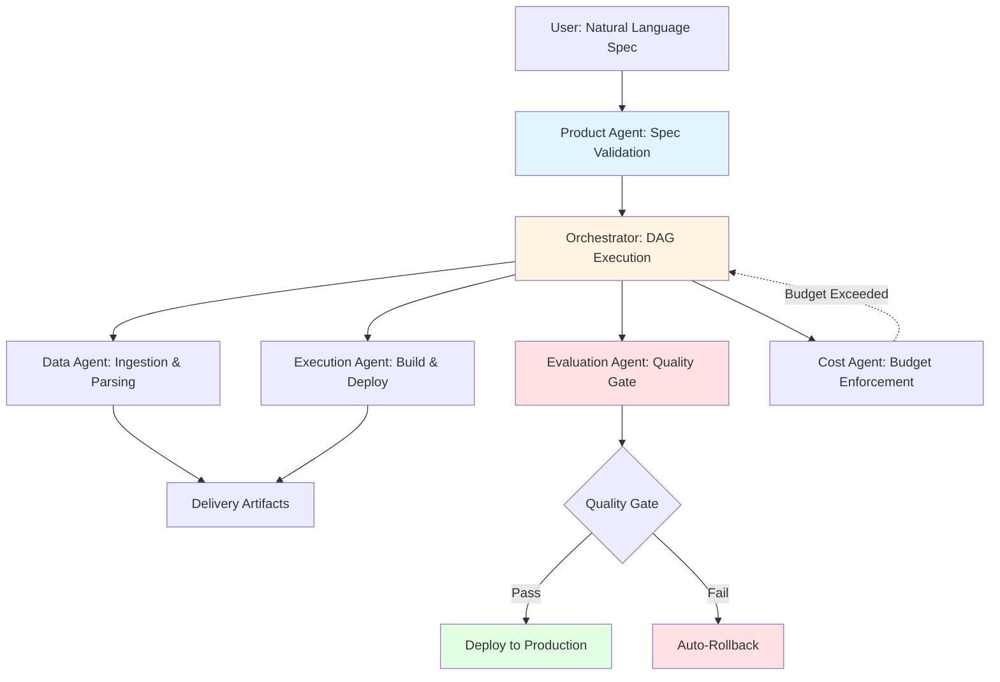

# Agentic Delivery OS

**From vague LLM ideas to production-grade, auditable systems**

[](LICENSE)
[](https://www.python.org/downloads/)
[](#)

---

## Why This Exists

Most "AI agent frameworks" are demos. They show you how to chain LLM calls.

**This is not that.**

The industry has a delivery problem:
- **Prompt engineering ≠ Production engineering**
- LLM outputs are non-deterministic, but systems must be auditable
- "It works on my machine" doesn't cut it when compliance is involved
- Agent frameworks optimize for demos, not for rollback, governance, or multi-tenancy

**Agentic Delivery OS** solves the gap between "I want to build an AI system" and "I need to ship, monitor, rollback, and audit it in production."

---

## What This Is

A **distributed, multi-tenant agent orchestration platform** that treats AI delivery as an engineering discipline, not a research experiment.

**This is NOT:**
- ❌ A chatbot framework
- ❌ A prompt playground
- ❌ An AutoGPT clone
- ❌ A one-shot code generator

**This IS:**
- ✅ A production delivery system with governance gates
- ✅ A multi-agent orchestrator with explicit DAGs, not implicit loops
- ✅ A platform where every decision is auditable and replayable
- ✅ An architecture that enforces separation between planning, execution, and evaluation

---

## Core System Design

### The Problem with "Agent Frameworks"

Most frameworks treat agents as autonomous entities that "figure it out." This fails in production because:
1. **No accountability** — who decided to delete that data?
2. **No rollback** — how do you undo an agent's action?
3. **No governance** — how do you enforce cost limits or compliance rules?

### Our Approach: Agents as Roles, Not Personalities



Each agent has **one job**, **explicit inputs/outputs**, and **failure semantics**.

---

## Repository Structure

```
agentic_delivery_os/
├── benchmarks/           # Evaluation tasks & regression tests
│   ├── default_tasks.json
│   └── tasks/            # Task definitions
│
├── memory/               # Long-term learning & agent profiles
│   ├── agent_profiles/   # Performance history per agent
│   ├── extracted_patterns/  # Cross-run pattern mining
│   └── global_state.db   # SQLite-backed memory
│
├── learning/             # Advanced learning algorithms
│   ├── contextual_bandit.py   # Context-aware strategy selection
│   ├── offline_rl.py          # Safe RL from replay buffer
│   ├── meta_policy.py         # Cross-tenant pattern learning
│   └── unified_policy.py      # Policy orchestration
│
├── runtime/              # Execution engine
│   ├── agents/           # Role-based agent implementations
│   ├── concurrency/      # Execution pool & rate limiting
│   ├── distributed/      # Control plane & worker management
│   ├── tenancy/          # Multi-tenant isolation
│   └── governance/       # Access control & safety gates
│
├── backend/              # API layer
│   ├── api/              # REST endpoints
│   └── orchestration/    # Task scheduling
│
├── apps/web/             # Control plane UI (Next.js)
│   ├── src/app/          # Pages: projects, runs, agents
│   └── src/components/   # Reusable UI components
│
└── security/             # Governance & compliance
    └── (opt-in tenant privacy controls)
```

**Key Insight:** This isn't a monolith. It's a **layered system** where each layer has a contract.

---

## What Makes It Different

### 1. **Governance-First, Not Prompt-First**

| Traditional Agent Frameworks | Agentic Delivery OS |
|------------------------------|---------------------|
| "Let the agent decide" | Explicit decision gates |
| Retry until it works | Fail fast with rollback |
| Black-box execution | Full audit trail (JSON artifacts) |
| One-shot demos | Multi-tenant production |

### 2. **Replayability as a First-Class Citizen**

Every run produces a complete artifact trail:
```
artifacts/
├── session/          # Cross-run session state
├── goals/            # Goal interpretation & planning
├── agent_profiles/   # Agent performance metrics
├── eval/             # Quality scores & benchmarks
└── learning/         # Policy updates & rationale
```

You can **replay any run** to understand exactly what happened and why.

### 3. **Learning That Doesn't Break Production**

- **Contextual Bandit (LinUCB)**: Adapts strategy selection based on run context (goal type, cost constraints, risk level)
- **Offline RL (Conservative Q-Learning)**: Learns from replay buffer, never touches production directly
- **Meta-Learning**: Cross-tenant pattern extraction with privacy-preserving opt-in controls

**Safety guarantee:** RL policies run in shadow mode and require approval before production use.

### 4. **Multi-Tenancy with Real Isolation**

Not just "user IDs in a database." Each tenant gets:
- Isolated memory & learning state
- Budget profiles with cost enforcement
- Policy spaces (custom planner/tool/agent configurations)
- Opt-in/opt-out for meta-learning

---

## Use Cases

### Enterprise RAG Delivery
Non-technical users specify requirements via a wizard. The system:
1. Validates the spec
2. Ingests & parses documents
3. Builds retrieval index
4. Runs evaluation benchmarks
5. Deploys with rollback capability

**Output:** A production-ready RAG system, not a Jupyter notebook.

### Multi-Agent Task Orchestration
Define complex workflows with explicit DAGs:
- Conditional branching based on agent outputs
- Cost-aware path selection
- Automatic rollback on quality gate failures

### Continuous Learning from Production
- Agents track task affinity (which agents excel at which tasks)
- Tools track ROI (cost vs. value contributed)
- Policies auto-promote when quality score > 0.9

---

## Quick Start

```bash
# Clone the repo
git clone https://github.com/Benjamindaoson/agentic-delivery-os.git
cd agentic-delivery-os

# Install dependencies
pip install -r requirements.txt

# Start the system (choose one)
python run.py web    # Web UI at http://localhost:8501
python run.py api    # REST API at http://localhost:8000
python run.py cli    # Command-line interface
```

### Run a Task

```python
from runtime.l5_engine import L5Engine

engine = L5Engine()
result = engine.execute_run(
    query="What is machine learning?",
    session_id="demo_session"
)

print(f"Quality: {result['eval'].quality_score}")
print(f"Cost: ${result['eval'].cost}")
```

### Inspect a Run

```bash
python agentctl.py inspect run_abc123
```

This shows you the **full causal chain**: Goal → Plan → DAG → Agent → Tool → Evidence.

---

## Roadmap

### ✅ Shipped (L6 Certified)
- [x] Distributed execution (control plane + workers)
- [x] Multi-tenant isolation with budget enforcement
- [x] Contextual bandit for strategy selection
- [x] Offline RL with shadow mode
- [x] Privacy-preserving meta-learning
- [x] Full audit trail & replayability

### 🚧 In Progress
- [ ] Interactive execution graph UI (pause/resume/retry)
- [ ] Real-time learning visualization dashboard
- [ ] Kubernetes deployment templates

### 🔮 Future (L7+)
- [ ] Federated learning across tenants
- [ ] Active learning for labeling optimization
- [ ] Multi-modal agents (vision + text + audio)
- [ ] Blockchain-based immutable audit trail

---

## Philosophy

**Agent Engineering ≠ Prompt Engineering**

Building production AI systems requires:
1. **Explicit contracts** between components
2. **Failure semantics** that don't rely on "retry until it works"
3. **Governance gates** that enforce compliance, cost, and quality
4. **Auditability** so you can answer "why did the system do that?"

This system embodies those principles.

**We believe:**
- Agents should have roles, not personalities
- Execution should be deterministic, not emergent
- Learning should be safe, not reckless
- Production systems should be boring, not magical

---

## Contributing

We welcome contributions that align with the system's philosophy:
- **New agents:** Define clear contracts in `config/agents.yaml`
- **New tools:** Implement with explicit permission models
- **New learning algorithms:** Must include shadow mode & approval gates
- **UI improvements:** Focus on auditability, not aesthetics

See [CONTRIBUTING.md](CONTRIBUTING.md) for details.

---

## License

[MIT License](LICENSE)

---

## Citation

If you use this system in your research or production deployments, please cite:

```bibtex
@software{agentic_delivery_os,
  title = {Agentic Delivery OS: Production-Grade Multi-Agent Orchestration},
  author = {Your Name},
  year = {2025},
  url = {https://github.com/Benjamindaoson/agentic-delivery-os}
}
```

---

## Acknowledgments

This system is built on the principle that **AI systems should be engineered, not improvised**.

Inspired by:
- Production ML systems at scale (Uber, Airbnb, Netflix)
- Formal methods in distributed systems
- The gap between research demos and real-world deployments

---

**Status:** 🟢 L6 Certified — Ready for Production  
**Last Updated:** 2025-12-23

---

## Join the Discussion

- **Issues:** [GitHub Issues](https://github.com/Benjamindaoson/agentic-delivery-os/issues)
- **Discussions:** [GitHub Discussions](https://github.com/Benjamindaoson/agentic-delivery-os/discussions)

**If you believe AI systems should be auditable, governable, and production-ready — not just impressive demos — this project is for you.**

⭐ **Star this repo** if you think agent engineering deserves better tooling.
